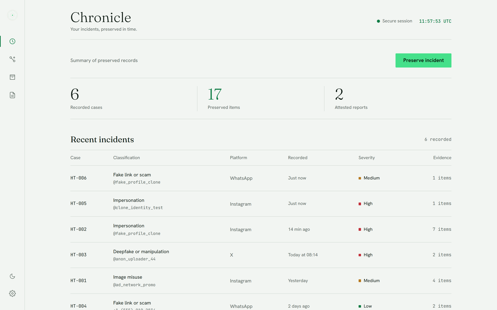
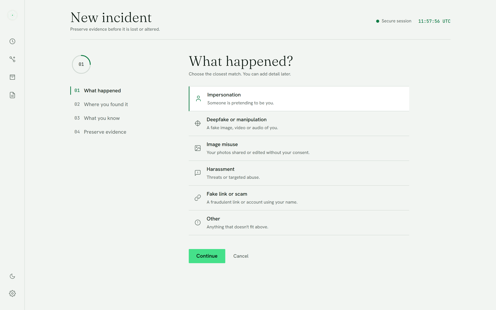
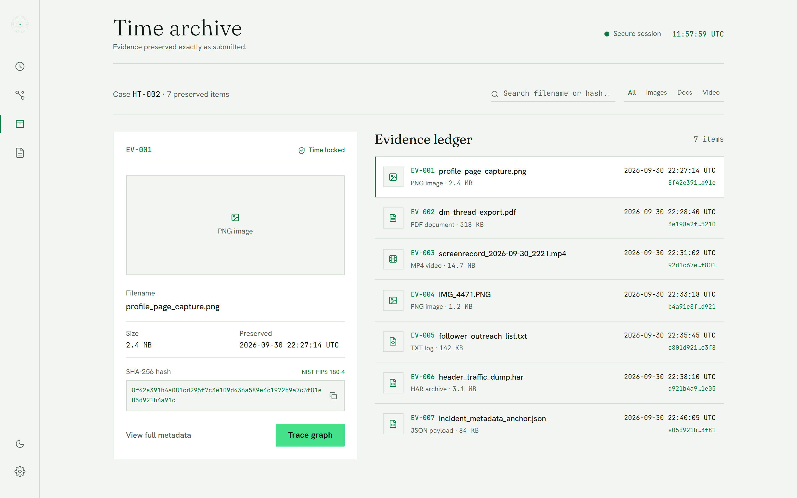
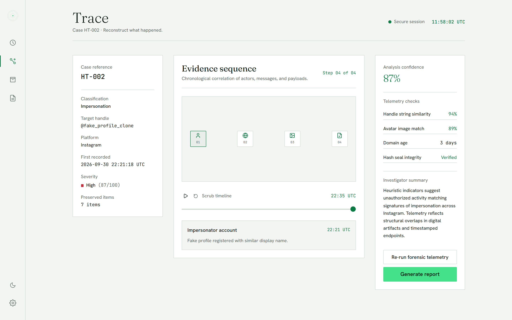
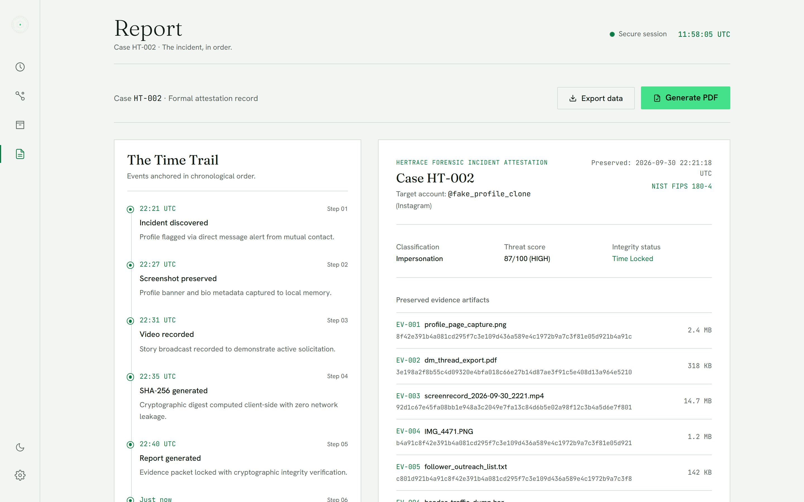

# HERTRACE — Digital Evidence Preservation & Incident Reconstruction

> *"Time preserves the truth."*

[](https://react.dev/)
[](https://www.typescriptlang.org/)
[](https://vite.dev/)
[](https://tailwindcss.com/)
[](https://nodejs.org/)
[](https://sqlite.org/)
[](https://csrc.nist.gov/publications/detail/fips/180-4/final)

**HERTRACE** is an end-to-end, high-integrity digital evidence preservation and incident reconstruction platform designed to support victims of online impersonation, deepfakes, unauthorized media dissemination, and coordinated cyber harassment. 

Engineered with a serious, high-integrity security aesthetic (inspired by Linear, Vercel, and 1Password admin consoles), HERTRACE bridges the gap between traumatic cyber incidents and legally actionable, cryptographically anchored digital evidence.

---

## 🎯 Problem Statement

The exponential proliferation of generative AI, deepfake manipulation tools, and ephemeral messaging has drastically increased non-consensual online harm—disproportionately impacting women and vulnerable individuals across social media (Instagram, WhatsApp, Telegram, X, and web platforms).

When an attack occurs, victims face three acute challenges:

1. **Ephemeral & Disappearing Evidence**: Malicious profiles, fake links, manipulated stories, and harassing messages are routinely deleted or suspended within hours. Without rapid, verified preservation, the perpetrator's digital footprint evaporates before an investigation can begin.
2. **Chain of Custody & Admissibility Hurdles**: Conventional screenshots and screen recordings lack verifiable cryptographic provenance and are easily disputed as doctored or fabricated in platform takedown notices and courtrooms.
3. **Trauma-Inducing Technical Complexity**: Standard digital forensics tools are built for enterprise security analysts, leaving stressed victims without an intuitive, calm, and protective interface to document incidents while preserving their privacy.

---

## 💡 Proposed Solution

**HERTRACE** reimagines digital evidence preservation as an immutable, time-anchored vault:

- **Local-First Cryptographic Anchoring**: Leverages the native Web Crypto API and backend NIST FIPS 180-4 SHA-256 engines to calculate cryptographic fingerprints for media files, network headers, and logs upon discovery.
- **Incident Reconstruction & Dependency Mapping**: Synthesizes isolated screenshots, URLs, and communication threads into an interactive, time-scrubbable dependency graph demonstrating origin, delivery method, and impact.
- **Hedged AI Forensic Telemetry**: Employs probabilistic heuristic intelligence (evaluating handle character substitutions, facial warp markers, perceptual image matches, and account velocity) adhering to strict forensic hedging language (*"possible"*, *"heuristic indicators suggest"*).
- **Attested "Eye of Agamotto" Time Trail**: Structures an immutable chronological timeline concluding with a digital attestation seal, yielding an exportable, court-ready forensic report packet.

---

## ✨ Features

- **🛡️ 4-Step Calm Incident Intake Wizard (`/incident/new`)**:
  - Step-by-step guidance tailored for stressful situations: Incident Classification -> Target Platform -> Account / URL Telemetry -> Evidence Drop.
  - Multi-file drag-and-drop evidence vault with instantaneous client-side SHA-256 calculation.
  - Supports image captures, screen recording videos, PDF documents, network HAR archives, and server log files.

- **📊 Chronicle Dashboard (`/chronicle`)**:
  - Real-time stat telemetry tracking active cases, verified evidence artifacts, high-risk flags, and sealed reports.
  - Dense incident investigation table with risk severity indicators (`HIGH`, `MEDIUM`, `LOW`), platform tags, and search/filtering.

- **🗄️ Time Archive Vault (`/archive`)**:
  - Card-based evidence repository featuring procedural SVG forensic previews for every artifact.
  - Real-time verified badges, file byte counters, truncated SHA-256 digests, and expanding green ring upload animations.
  - 360px slide-in metadata detail drawer with single-click SHA-256 copying and direct artifact downloading.

- **🕸️ Trace Reconstruction & Graph Visualization (`/trace/:id`)**:
  - Interactive SVG dependency graph linking accounts, URLs, and corroborating evidence.
  - Interactive scrub slider allowing investigators to step forward and backward across the chronological timeline.
  - Plain-language forensic telemetry checklist displaying match percentages and metadata integrity checks.
  - **"Re-run forensic telemetry"** action hooked directly into the backend AI heuristic engine.

- **📜 Time Trail & Sealed Forensic Report (`/report/:id`)**:
  - Vertical chronological reconstruction trail culminating in the signature Time Ring seal node.
  - Formal multi-step PDF / Plaintext attestation generation simulating full cryptographic compilation.
  - Downloadable sealed evidence packet (`HERTRACE_<ID>_EvidencePacket.txt`) containing case metadata, timeline chronology, and NIST FIPS 180-4 verification keys.

- **⚙️ High-Performance Full-Stack Architecture**:
  - Express 5 REST API running natively on Node 24 with TypeScript type stripping.
  - Embedded SQLite database running in WAL mode with auto-seeding for zero-setup demo readiness.
  - Multipart file storage pipeline serving verified uploads via dedicated `/uploads/` endpoints.
  - Real-time frontend status indicator badge displaying live backend vault connectivity in the header navigation.

---

## 🛠️ Technologies / Tech Stack Used

### Frontend
- **React 19**: Modern component architecture utilizing concurrent hooks and functional state.
- **TypeScript**: Strict compile-time type definitions across domain models and API contracts.
- **Vite 8**: Next-generation lightning-fast build tooling and reverse proxy engine.
- **Tailwind CSS v4**: Utility-first styling with custom dark-mode security tokens (`#080A09` background, `#45E08A` green accent discipline).
- **React Router v7**: Declarative client-side routing and deep-linking.
- **Lucide React**: Minimalist 16/18px icons with uniform 1.5 stroke width.
- **Framer Motion**: Smooth entry transitions, ring expansions, and state animations.

### Backend & Storage
- **Node.js 24**: Native TypeScript execution using `--experimental-strip-types`.
- **Express 5**: RESTful API layer managing incident records, telemetry, and attestation.
- **SQLite (Node `DatabaseSync`)**: High-performance embedded database running in WAL (Write-Ahead Logging) mode.
- **Multer**: Streaming multipart form-data parser handling file storage in `server/uploads/`.
- **Concurrently**: Single-command orchestrator for synchronized full-stack development.

### Security & Forensics
- **NIST FIPS 180-4 SHA-256**: Dual-layer cryptographic hashing on both the browser (Web Crypto API) and backend disk vault.
- **Attestation Sealing Algorithm**: Cryptographic signature generation linking Case ID + UTC timestamp + all artifact digests into a master verification seal.

---

## 📸 Screenshots / Demo Images

### 1. Landing & Entry Portal (`/`)
*Centered Time Stone-inspired concentric motif with intro sequence and instant case intake routing.*


---

### 2. Chronicle Dashboard (`/chronicle`)
*Real-time case telemetry, risk scoring breakdown, active incident tracker, and dense audit table.*



---

### 3. Calm Incident Intake Wizard (`/incident/new`)
*4-step guided intake with client-side SHA-256 calculation and drag-and-drop evidence dropzone.*



---

### 4. Time Archive Evidence Vault (`/archive`)
*Forensic card grid with procedural SVG visualizers, truncated digests, and slide-in artifact inspection drawer.*



---

### 5. Trace Reconstruction Workspace (`/trace/:id`)
*Interactive dependency graph, chronological scrub timeline, and hedged AI telemetry evaluation panel.*



---

### 6. Time Trail & Forensic Attestation Report (`/report/:id`)
*Chronological trail ending in the Eye of Agamotto seal, formal incident packet preview, and sealed export generator.*



---

## 📁 Project Structure

```
code_divas/
├── server/                         # Backend Express API & Database
│   ├── data/
│   │   └── hertrace.db             # Persistent SQLite Database (WAL mode)
│   ├── uploads/                    # Local Evidence File Vault
│   │   └── .gitkeep
│   ├── crypto.ts                   # NIST FIPS 180-4 SHA-256 & Attestation Seal Engine
│   ├── db.ts                       # SQLite Schema, Queries & Audit Logger
│   ├── forensics.ts                # AI Risk Scoring, Heuristics & Dynamic Graph Generator
│   ├── index.ts                    # Express Server Entry Point (Port 3001)
│   ├── reports.ts                  # Forensic Attestation Report Packet Compiler
│   ├── routes.ts                   # REST API Endpoints (/api/incidents, /api/seal, etc.)
│   └── seed.ts                     # Database Auto-Seeder with Baseline Incidents
│
├── src/                            # Frontend React 19 Application
│   ├── api/
│   │   └── client.ts               # Typed Frontend API Client for Backend Endpoints
│   ├── assets/                     # Application Icons and Media Assets
│   ├── components/                 # Modular Design System Components
│   │   ├── AppLayout.tsx           # Global Navigation & Status Shell
│   │   ├── EvidenceCard.tsx        # Archive Card with Procedural SVG Visualizer
│   │   ├── EvidenceDetailDrawer.tsx# 360px Slide-in Inspector & Download Action
│   │   ├── ForensicPreview.tsx     # Procedural Evidence Graphics
│   │   ├── LiveClock.tsx           # UTC Live Cryptographic Clock
│   │   ├── RiskBadge.tsx           # HIGH / MEDIUM / LOW Severity Badges
│   │   ├── Sidebar.tsx             # Linear-style Navigation Rail
│   │   ├── TimeRingMotif.tsx       # Rotating Concentric Gem Sigil
│   │   ├── TopBar.tsx              # Telemetry Header & Live Vault Connection Status
│   │   └── UploadDropzone.tsx      # Drag & Drop Vault with Client-Side Hashing
│   ├── context/
│   │   ├── IncidentContext.tsx     # State Manager, API Bridge & Vault Dispatcher
│   │   └── ThemeContext.tsx        # Dark Security Theme Provider
│   ├── data/
│   │   └── mock.ts                 # Initial Baseline Incidents & Telemetry Records
│   ├── pages/                      # Application Route Views
│   │   ├── ArchivePage.tsx         # Time Archive Vault Screen
│   │   ├── ChroniclePage.tsx       # Dashboard Telemetry & Incidents Screen
│   │   ├── LandingPage.tsx         # Initial Entry Screen & Gem Animation
│   │   ├── NewIncidentPage.tsx     # 4-Step Intake Flow
│   │   ├── ReportPage.tsx          # Chronological Trail & Attestation Export
│   │   └── TracePage.tsx           # Graph Reconstruction & Scrub Workspace
│   ├── types/
│   │   └── index.ts                # TypeScript Interfaces (Incident, EvidenceItem, etc.)
│   ├── App.tsx                     # Route Configurator & Root Providers
│   └── main.tsx                    # React DOM Mounting Entry Point
│
├── screenshots/                    # High-Resolution UI Demo Screenshots
│   ├── 01_landing_entry.png
│   ├── 02_chronicle_dashboard.png
│   ├── 03_intake_wizard.png
│   ├── 04_evidence_archive.png
│   ├── 05_trace_reconstruction.png
│   └── 06_forensic_report.png
│
├── package.json                    # Dependencies & Run Scripts
├── tsconfig.json                   # TypeScript Compiler Configuration
└── vite.config.ts                  # Vite Config with Strict Port 3000 & Backend Reverse Proxy
```

---

## 📥 Installation & Setup Instructions

### Prerequisites
- **Node.js**: `v20.x` or `v24.x` (Recommended: `v24.15+` for native TypeScript type execution)
- **npm**: `v10.x` or `v11.x`
- **Git**

### Step-by-Step Setup

1. **Clone the repository**:
   ```bash
   git clone https://github.com/siyaagrawal475-rgb/code_divas.git
   cd code_divas
   ```

2. **Install all dependencies**:
   ```bash
   npm install
   ```

3. **Verify build integrity**:
   ```bash
   npm run build
   ```

---

## 🚀 How to Run the Project

### Running Both Frontend & Backend Concurrently (Recommended)

Start the full stack with a single command:

```bash
npm run dev
```

This concurrently launches:
- 🖥️ **Frontend Application**: **[http://localhost:3000](http://localhost:3000)**
- 🛡️ **Backend Vault API**: **[http://localhost:3001](http://localhost:3001)**
- 📡 **Health Check Endpoint**: [http://localhost:3001/api/health](http://localhost:3001/api/health)

*(The frontend reverse-proxies `/api/*` and `/uploads/*` requests seamlessly to port `3001`.)*

### Running Services Independently

- **Run only the Backend Vault Server**:
  ```bash
  npm run server
  ```
- **Run only the Frontend Vite Client**:
  ```bash
  npm run dev:client
  ```

---

## 👥 Team Members

HERTRACE was conceived, architected, and built by:

- **Siya Agrawal**
- **Divyani Papalkar**
- **Yashi Dubey**
- **Manyata Rai**

---

## 🔮 Future Scope & Enhancements

1. **Public Decentralized Blockchain Anchoring**:
   - Anchoring attestation hashes to public distributed ledgers (e.g., Hedera Hashgraph, Polygon, or Ethereum) for decentralized, mathematically indisputable timestamp proofs that do not rely on a single server authority.

2. **Automated One-Click Browser Capture Extension**:
   - A companion Chromium/Firefox extension to preserve social media profiles, comments, and posts with a single click, recording HTTP headers, DOM structure, SSL certificates, and network HAR files instantly.

3. **Direct Integration with Legal & Grievance Portals**:
   - Automated export formatting for the **National Cyber Crime Reporting Portal (NCRP)**, law enforcement cyber cell guidelines, and Meta / X / Telegram takedown API webhooks.

4. **Multi-Party Chain-of-Custody Digital Signatures**:
   - Cryptographic signing keys for legal aid representatives, digital forensics experts, and victims to countersign evidence packets before court submission.

5. **Client-Side Neural Deepfake & Voice Analysis (WebAssembly)**:
   - On-device lightweight neural models running via WebAssembly/WebGPU to scan image noise prints, frame inconsistencies, and spectral audio distributions without uploading raw media to external clouds.

---

<p align="center">
  <b>HERTRACE</b> — Digital Evidence Preservation & Incident Reconstruction<br>
  <i>"Time preserves the truth."</i>
</p>
